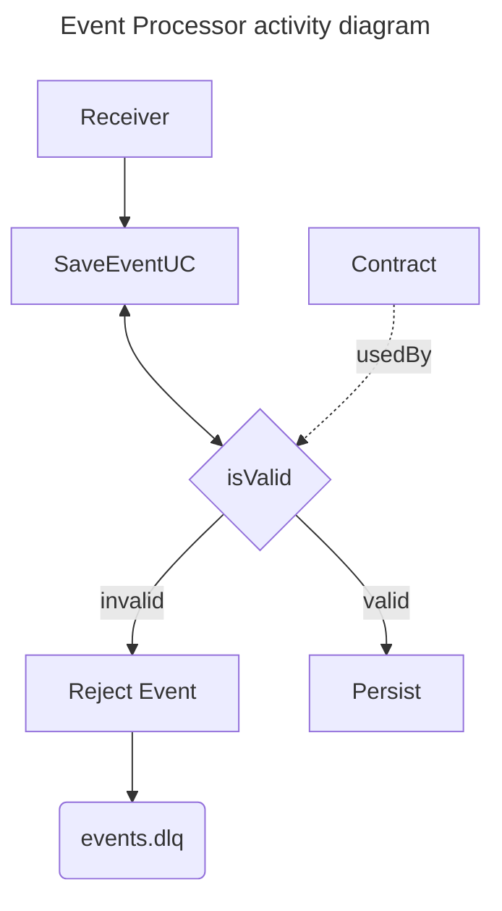

# Event Processor
This is an event pipeline application
where several producers can post their events to be validated and persisted
so that another application can send the event to the end client.

Event contract validations will be described in a configuration file.

# Architecture




# running project
1. Cloning `.env.example`
```shell
cd deployments
cp .env.example .env
```
2. in cd deployments path, run terraform with
```shell
  export $(cat .env | xargs -I% echo TF_VAR_%)
  cd terraform
  terraform init
  terraform plan
  terraform apply
```

# @TODO
 * [ ] Create Rabbitmq instance and provision it via terraform
 * [ ] Create a consumer for the events
 * [ ] Create a configuration contract reader 
 * [ ] Create a validator that uses the contract to reject invalid events 
 * [ ] Use a database to persist the events and be read in the future by the sender 
 * [ ] Create a parameterizable producer to put events in the pipeline 
 * [ ] Create acceptance tests 
 * [ ] Create load tests 
 * [ ] Create user on rabbitmq for application only
 * [ ] Optimize flow 
 * [ ] Create a docker container for the app 
 * [ ] Move to LocalStack 
 * [ ] Use terraform to declare resources