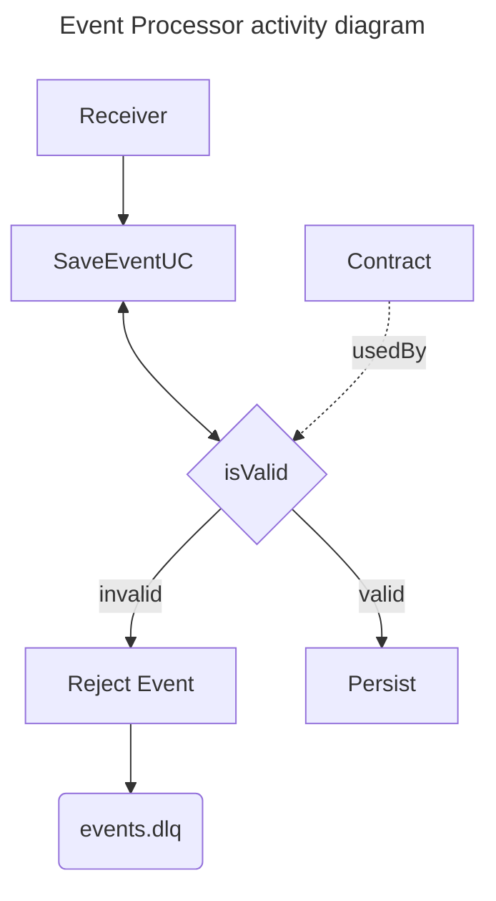

# Event Processor
This is an event pipeline application
where several producers can post their events to be validated and persisted
so that another application can send the event to the end client.

Event contract validations will be described in a configuration file.

# Architecture

# @TODO
 * [ ] Criar um consumer para os eventos
 * [ ] Criar um leitor de contrato de configuração
 * [ ] Criar um validator que utiliza o contrato para rejeitar os eventos inválidos
 * [ ] Utilizar um banco para persistir os eventos e ser futuramente lido pelo sender
 * [ ] Criar um producer parametrizável para colocar eventos no pipeline
 * [ ] Criar testes de aceitação
 * [ ] Criar testes de carga
 * [ ] Otimizar o fluxo
 * [ ] Criar um container docker para o app
 * [ ] Mover para o LocalStack
 * [ ] Usar terraform para declarar os recursos