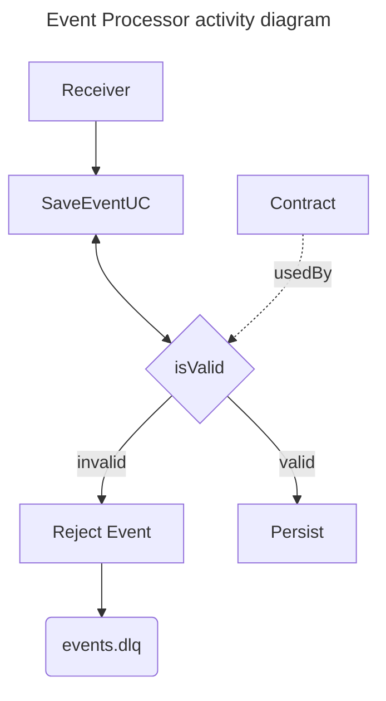

# Event Processor
This is an event pipeline application
where several producers can post their events to be validated and persisted
so that another application can send the event to the end client.

Event contract validations will be described in a configuration file.

# Architecture




# Running the project
1. Cloning `.env.example`:
```shell
cd deployments
cp .env.example .env
```

2. Starting dependencies:
```shell
docker compose up -d rabbitmq mongodb
```

3. In deployments path, run terraform with:
```shell
export $(cat .env | xargs -I% echo TF_VAR_%)
cd terraform
terraform init
terraform apply
```

4. Up event-processor service:
```shell
cd ../
docker compose up event-processor
```
After build image you will see: 
```
starting event processor...
 [*] Waiting for messages
```

5. starting producers on another terminal:
```shell
cd deployments
docker compose up event-producer
```
Then you can see the events flowing from the producer to the processor
and being saved in mongoDb in the `events` collection.

# Creating a new event schema
You can use this website to create a JSON Schema: 

https://www.jsonschemavalidator.net/

using this file as a template: [event-base.schema.json](configs/events-schemas/event-base.schema.json)
and following specification [draft/2019-09](https://json-schema.org/draft/2019-09/json-schema-validation) 

After building and validating schema, save on path `configs/events-schema/` with name `<eventType>.schema.json`,
replacing `<eventType>` with the eventType value expected to use this schema to validate them.

# ADRs
* [choose-schema-validator.md](docs/adr/choose-schema-validator.md)
* [choose-how-to-organize-events-schemas.md](docs/adr/choose-how-to-organize-events-schemas.md)

# @TODO
* [X] Create Rabbitmq instance and provision it via terraform
* [X] Create a consumer for the events
* [X] ~~Create a configuration contract reader~~ 
* [X] Create a validator that uses the contract to reject invalid events 
* [X] Use a database to persist the events and be read in the future by the sender 
* [X] Create a docker container for the app
* [ ] Increase coverage test
* [ ] Create acceptance tests 
* [ ] Create load tests 
* [ ] Create user on rabbitmq for application only
* [ ] Move to LocalStack 
* [ ] Use terraform to declare resources
* [ ] Create a parameterizable producer to put events in the pipeline
* [ ] Change Dockerfile to be multi-stage build
* [ ] Optimize flow
